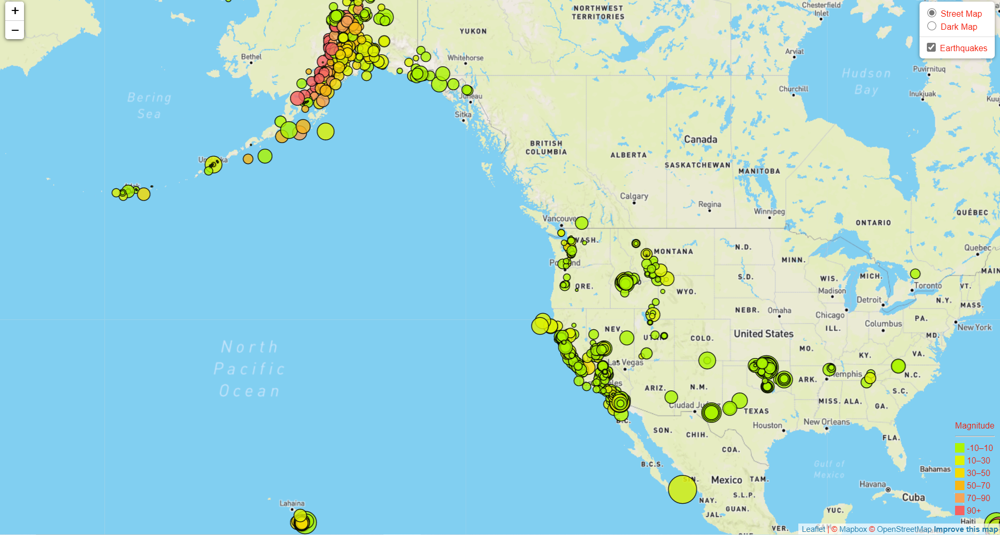

# leaflet-challenge

# Table of contents:
*	General Info
*	Technologies
*	Features
*	Setup
*	Status
*	Contact

# General info:
* Leaflet is the leading open-source JavaScript library for mobile-friendly interactive maps and used to build web mapping applications.
* Leaflet supports Web Map Service (WMS) layers, GeoJSON layers, Vector layers and Tile layers natively.

# Technologies:
*	We used visual studio code.

# Features:
*  Map is created using Leaflet that ploted all of the earthquakes from data set based on their longitude and latitude.

*  Data markers reflect the magnitude of the earthquake by their size and depth of the earth quake by color. Earthquakes with higher magnitudes appear larger and earthquakes with greater depth appear darker in color.

*  Popups provide additional information about the place,time and magnitude of the earthquake when a marker is clicked.

*  Legend is created that will provide context of map data.Depending on the magnitde of the earthquake, colour is determined. Darker the color, greater is the magnitude and vice versa.
Below is the snip of the streetmap:

# Setup:
*	There was no specific setup done to work with leaflet.
*	Visual studio code was used to write the index.html, logic.js.

# Status
Project is finished

# Contact
D. Sai Prasanna